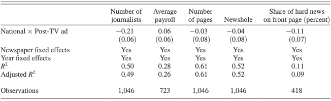
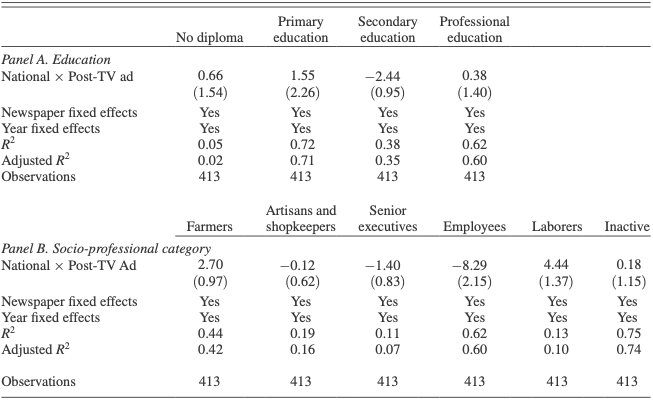

# Abstract
The present paper aims to replicate the results from Angelucci & Cage’s paper, and provides more validity to the finding that alternate advertising platforms tend to decrease the newspaper producers'incentives to advertise, whcih leads to a decrease in journalistics-intensive content in the newspapers. Our findings duplicated the results in Angelucci & Cage that a decrease in advertising revenues has effects on newspaper's contents and focus on readership.

# Keywords
Advertising revenues; French newspaper; Journalistic-intensive content; Readership; Pricing strategies

# Github Repository
Code for this analysis is available at: https://github.com/Christinax86-tech/Final

```{r setup, include=FALSE}
knitr::opts_chunk$set(echo = TRUE)
library(haven)
library(tidyverse)
library(knitr)
library(ggplot2)
library(car)
library(MASS)
library(data.table)
library(memisc)
```
# Introduction

The advancement in communication technology today provides general readers with more ways to access information. People can easily fetch news from  TV, smartphones, tablets, etc. It is of interest that how newspaper industry change their method of delivering news, and how their advertising revenues changes corresponding with the newspaper content and pricing. In Angelucci & Cagé's “Newspapers in Times of Low Advertising Revenues”, they explored the shock brought to the advertising side of French newspaper industry with the introduction of television advertising. Also, they used empirical analysis to discover the relationship between advertising revenues and the incentive of newspaper producers put journalistic-intensive contents in their publications (Angelucci & Cagé, 2015). They found that there was a decline in newspaper producers’ willingness to pay for advertising for attracting readers’ attention with the introduction of alternative advertising platforms; also, a decrease in advertising avenue lead to a corresponding decrease in journalistic-intensive content in newspaper (Angelucci & Cage, 2015). 
The present paper aims to reproduce these results using simple linear model with ordinary least squares estimators. Based on the results obtained from models, our findings were that a decrease in advertising revenues has effects on newspaper's contents and focus on readership, which were a decrease in journalist-intenstive contents and switch of focus on less educated readership. These findings duplicated the findings in Angelucci & Cage's paper.


#Data
The data would be the data used in Angelucci & Cagé’s paper: the information about newspaper prices, revenues, and circulation from the French Ministry of Information’s non-publicly available records in the National archives, which includes 68 local newspapers and 12 national newspaper; the number of journalist from the non-publicly available paper records of the “Commission de la carte d’identité des journalistes professionnels” (CCIJP) , which includes 63 out of the 68 local newspapers for which we have revenue data, and 11 out of the 12 national newspapers; information about advertising prices and quantity of advertising from “Tarif Media,” and French National Library respectively.
However, since we tried to duplicate their results, we only chose the varaibles that were of interest. They included two aspects: newspaper production side and readership side. Potential response variables in newspaper production included total circulation, number of pages in publication, news-hole, number of journalists; potential response variables in readership included: subscription price per issue, unit buyer price, percentage of share of subscribers, reader's level of education.
```{r include = FALSE}
#Set up the required data by selecting the variables that are interested from the raw dataset
dta <- as.data.frame(as.data.set(Stata.file("/Users/christina/PS5/data/Angelucci_Cage_AEJMicro_dataset.dta")))
dta <- 
  dta %>% 
  dplyr::select(year, id_news, after_national, local, national, 
         ra_cst, qtotal, pages, news_hole, nb_journ,  
         ps_cst, po_cst, qs_s, rs_cst, R_sh_edu_primaire_ipo,R_sh_edu_secondaire_ipo, R_sh_edu_no_ipo, R_sh_edu_sup_prof_ipo ) %>% 
  mutate_at(vars(id_news, after_national, local, national), ~as.factor(.)) %>% # Change some to factors
  mutate(year = as.integer(year))

```


```{r echo = FALSE}
skimr::skim(dta)
```
\emph{Figure 1} Overview of dataset with variables of interest

From Figure 1, we took a overall view on the dataset contained with these variables of interest.

#Model
The models we are interested in are based on the Ordinary Least Sqaures (OLS) method, which is a method commonly used to examine linear regression models :

$ln(Y_n,_t) = \beta_0 + \beta_1 + ...+\beta_n +\epsilon$

where 

- $\hat \beta_0$ is the OLS estimator of the intercept coefficient $\beta_0$

- $\hat \beta_1 ...\hat \beta_n$ are the OLS estimators of the slope coefficients $\beta_1...\beta_n$

- $\epsilon$ is a random error term

The rationale of the estimated models in present paper are based on the OLS simple regression function

$\hat Y = \hat\beta_0 + \hat\beta_1 X_n$

By using the OLS estimation, we can minimize the sum of the squared residuals, in other words, minimize the squared prediction errors of the model. This means that we can obtain a more accurate model using OLS. In this case, Y represents the predictor variable, which is advertising avenue, X represents the response varaibles, which were selected based on the findings in Angelucci & Cagé, 2015. By doing this, we aimed to reproduce their results by examining the significance of the relationship between these response variables X and the predictor variable Y. We built two models, one is from the aspect of newspaper production, another is from the aspect of readership. Therefore, the response variables were selected respectively in terms of these two aspects, while the predictor variable, advertising avenue, stayed the same in each model.

First, we aimed to investigate the potential variables in newspaper production (total circulation, number of pages in publication, news-hole, number of journalists) that could be significantly influenced corresponding to the changes in advertising avenues. 

```{r echo = FALSE}
#Build simple linear regression model in terms of the newspaper production
model1 <- lm(ra_cst ~ qtotal + pages + news_hole + nb_journ, data = dta)
summary(model1)

```
\emph{Figure 2} The summary statistics for model1

```{r include = FALSE}
model2 <- lm(ra_cst ~ pages + news_hole + nb_journ, data = dta)
summary(model2)

model3 <- lm(ra_cst ~ qtotal + pages + news_hole, data = dta)
summary(model3)
```

We first included all the selected variables in model1 and the summary statistics indicated that they all have significant relationships with the predictor variables, since the p-values were extremely small. However, a best model should contain fewer number of variables if possible, since there is a chance that a variables had small p-value because of its co-effects with another variable contained in the model. In this case, if remove the other variable from the mode, as a result, the former variable would not have a significant relationship or its significant value decreases. Therefore, we removed variable of total pages of publications from the model in order to examine if there is a variable consequently has reduced significant level. Based on the summary statistics of model2, the p values basically remained unchanged. In the same way, we constructed the third model by removing variable, number of pages, from model1. The p-values of all the variables still remained unchanged.
However, it is worth mentioning that no matter which variable we remove from model1, the value of adjusted R-sqaured decreases. This suggests that all the variables contained in model1 are significant to the fit of regression model, in other words, by adding each of the variable into the model, the model became increasingly better. Therefore, for the newspaper production, variables which are total circulation, number of pages in publication, news-hole, number of journalists, can be affected by a change in advertising avenues.

However, the vif value of variable, number of journalists, was 5.18, which was higher than the threshold of 5. It means that this model had problem estimating the coefficients although its predictive ability was not affected. The vif values of model2 were good, which were all below the threshold of 5. 
```{r include = FALSE}
##Check vif values for each model
vif(model1)
vif(model2)
vif(model3)

##Check anova for each model
anova(model1)
anova(model2)
anova(model3)
```

```{r echo = FALSE}
#Investigate the validity of model
##Plot the purposed models
par(mfrow = c(2, 2))
plot(model1)
```
\emph{Figure 3} Plotting model2 and examining its validity

We also examined the validity of model2 by plotting the model in residuals vs. fitted graph, QQ plots, Scale-location plot and residual vs leverage plot.From the produced plots above, we can see that although there are some significant leverage points, the overall linear trend of model1 is clear.

Therefore, for newspaper production side, we decided to choose model2 as our estimated model, which contains variables: number of pages in publications, news-hole and number of journalists.

Second, we examined the potential variables in the reader side: subscription price per issue, unit buyer price, percentage of share of subscribers, reader's level of education. We removed the variables that showed no significant relationship with advertising revenues from model_1, and obatined model_2 with the rest of the variables: subscription price per issue, unit buyer price, percentage of share of subscribers, reader with primary education.
```{r include = FALSE}
#Build models in terms of readership 
model_1 <- lm(ra_cst ~ ps_cst + po_cst + qs_s + rs_cst + R_sh_edu_primaire_ipo + R_sh_edu_secondaire_ipo + R_sh_edu_no_ipo + R_sh_edu_sup_prof_ipo, data = dta)
model_2 <- lm(ra_cst ~ ps_cst + po_cst + qs_s + rs_cst + R_sh_edu_primaire_ipo, data = dta)
model_3 <- lm(ra_cst ~ qs_s + rs_cst + R_sh_edu_primaire_ipo, data = dta)
summary(model_1)
summary(model_2)
summary(model_3)

```

```{r echo = FALSE}
#Investigate the validity of model
##Plot the purposed models
par(mfrow = c(2, 2))
plot(model_3)
```
\emph{Figure 4} Plotting model_3 and examining its validity

Like what we did for model2 in newspaper production side, we also produced plots for model_3 in reader side. Also, the vif values for model_3 were all around 1, which means that the varaibles in model_3 did a good job on estimating coefficents.

```{r include = FALSE}
##Check vif calues for each model
vif(model_2)
vif(model_3)

##Check anova for each model
anova(model_2)
```

#Result
We have several key findings summarized from the model section.
First, the number of pages in publications, number of news-holes, and number of journalists were all associated with advertising revenues for newspaper industries; 
Second, the percentage of subsribers, revenues from sale, reader's education level were all poitively correlated with advertising revenues;
Third, which is an interesting finding, according to the summary statistics of model1, the number of news hole had negative correlated relationship with advertising revenues.


#Discussion
Our findings in present paper indicated several similarities with Angelucci & Cage’s paper. First, we found that increase in advertising revenues would lead to subsequent increase in number of pages in publications and increase in number of journalists. This shows that increase in advertising revenues provides incentives for improving quality of the publications, as the number of journalists and newsrooms increase. Although our finding generally duplicated Angelucci & Cage’s result that a decrease in advertising revenues would lead to a decrease in journalist-intensive contents in newspaper as the number of journalists decreases correspondingly (Angelucci & Cage, 2015), we found one difference with their findings: as the summary statistics of model1 indicated that the number of news hole had negative correlated relationship with advertising revenues. This means that as the advertising revenues increases, the number of news hole decreases. 

```{r echo = FALSE}

```
\emph{Figure 5} Findings in Angelucci & Cage's paper regarding advertising revenues and its effects on newspaper quality (Angelucci & Cage, 2015)

This finding was not corresponding to the suggestive evidence that provided in Angelucci & Cage’s (See Figure 5): the number of news hole remained unchanged under the shock wave brought by alternative news platform, although the number of journalists went fewer, which indicated a switch from hard news to soft news (Angelucci & Cage, 2015). The reason that we had this minor difference in finding with Angelucci & Cage might be we did not include the consideration of time of year. If we analyze the changes aftern the year 1967 (which is the important year that television advertising started to compete with newspaper advertising). 

```{r echo = FALSE}

```
\emph{Figure 6} Findings in Angelucci & Cage's paper regarding advertising revenues and its effects on readership (Angelucci & Cage, 2015)

Second, we found that newspaper tend to switch to focus on appealing to less educated reader group as the advertising revenues decreases. This result agreed with Angelucci & Cage’s finding that the collapse in advertising revenues led to a switch of focus on readership followed by readjustment of content and prices (See Figure 6). However, it is worth mentioning that they separated the local and national newspaper and examined the effects on them separately. These findings were mostly related to national newspaper since it seems that national newspaper was taken a huger blow compared to local newspaper (Angelucci & Cage, 2015).

#Weakness and Next Step
There are several weaknesses in the present paper. We did not exactly duplicate Angelucci & Cage's analysis procedures. In their paper, they 1) compared the changes in advertising revenues before and after the introduction of alternative advertising platforms such as televions, which is the year 1967; 2) considered the effects of decrease in advertising revenues on local and national newspaper separately. In the present paper, we soly considered the decrease in advertising revenues on newspaper industry and readership, which was more general compared to Angelucci & Cage's paper. However, this also means that our findings were less sophisticated compared to Angelucci & Cage's paper since we failed to do the difference-to-difference analysis method as they did in their paper. 

For future research, it is necessary to be more specific in terms of the research direction. It is recommaneded to use a different anlaysis method and see if the results duplicated that in Angelucci & Cage's paper.

#Reference
Angelucci, Cage. (2015). Newspapers in Times of Low Advertising Revenues. American Economic     Journal: Microeconomics, 11(3). DOI: 10.1257/mic.20170306

Luca Braglia (2016). RStata: A Bit of Glue Between R and Stata. R package
  version 1.1.1. https://CRAN.R-project.org/package=RStata

Yihui Xie (2014) knitr: A Comprehensive Tool for Reproducible Research in R.
  In Victoria Stodden, Friedrich Leisch and Roger D. Peng, editors,
  Implementing Reproducible Computational Research. Chapman and Hall/CRC. ISBN
  978-1466561595

Wickham et al., (2019). Welcome to the tidyverse. Journal of Open Source
  Software, 4(43), 1686, https://doi.org/10.21105/joss.01686
  
H. Wickham. ggplot2: Elegant Graphics for Data Analysis. Springer-Verlag New
  York, 2016.
  
John Fox and Sanford Weisberg (2019). An {R} Companion to Applied Regression,
  Third Edition. Thousand Oaks CA: Sage. URL:
  https://socialsciences.mcmaster.ca/jfox/Books/Companion/
  
Venables, W. N. & Ripley, B. D. (2002) Modern Applied Statistics with S.
  Fourth Edition. Springer, New York. ISBN 0-387-95457-0
  
Matt Dowle and Arun Srinivasan (2019). data.table: Extension of `data.frame`.
  R package version 1.12.8. https://CRAN.R-project.org/package=data.table
  
Martin Elff (2020). memisc: Management of Survey Data and Presentation of
  Analysis Results. R package version 0.99.27.3.
  https://CRAN.R-project.org/package=memisc
